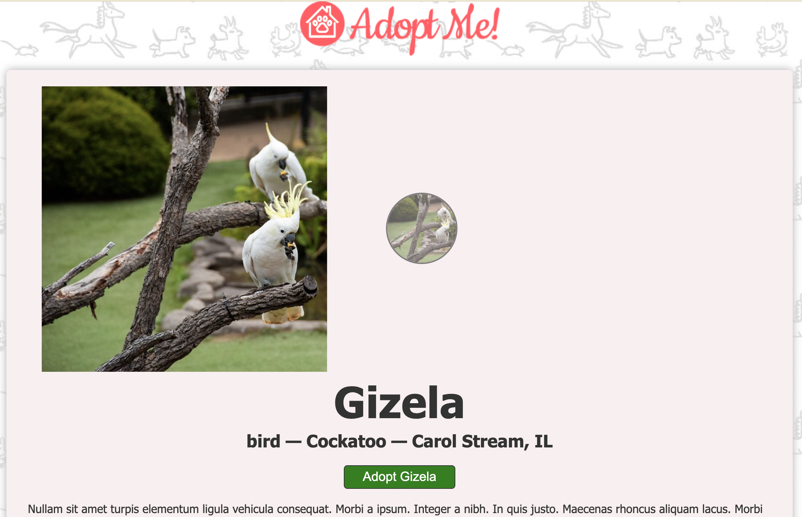

# adopt-me
A pet adoption site made with React

  ## Table of Contents

  * [Description](#Description)

  * [Installation](#Installation)

  * [Usage](#Usage)

  ## Description:
      This is a pet adoption site made using react. Information about pets is fetched from an api by Brian Holtz, and pets are rendered to the page, filtered by a search feature.
      
      Features:
      * error boundary for links which do not match available routes
      * modal to confirm adoption intention on 'details' page
      * theme context to change button color across pages
      * hooks, effects, and state use in React

  ## Installation:
  [Deployed Url](https://eliselabonte.github.io/adopt-me/)

  [Github Repository](https://github.com/eliselabonte/adopt-me)

  ## Usage:
      Browse pets of all kinds by name and type. See photos of your new best friends.